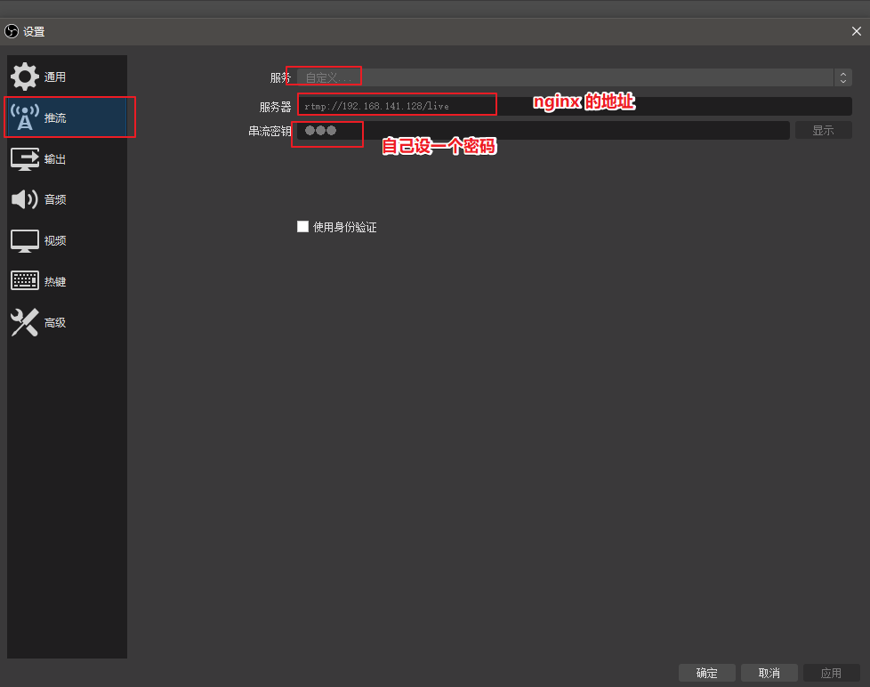

# Nginx

---

## 反向代理

反向代理(Reverse Proxy)方式是指以代理服务器来接受 internet 上的连接请求，然后将请求转发给内部网络上的服务器，并将从服务器上得到的结果返回给 internet 上请求连接的客户端，此时代理服务器对外就表现为一个反向代理服务器.

```vim
cd /usr/local/nginx/conf
vim nginx.conf


server {
    #侦听的80端口
    listen       80;
    server_name  localhost;

    location / {

        proxy_pass   http://127.0.0.1:81;    #在这里设置一个代理
        #以下是一些反向代理的配置可删除
        proxy_redirect             off;
        #后端的Web服务器可以通过X-Forwarded-For获取用户真实IP
        proxy_set_header           Host $host;
        proxy_set_header           X-Real-IP $remote_addr;
        proxy_set_header           X-Forwarded-For $proxy_add_x_forwarded_for;
        client_max_body_size       10m; #允许客户端请求的最大单文件字节数
        client_body_buffer_size    128k; #缓冲区代理缓冲用户端请求的最大字节数
        proxy_connect_timeout      300; #nginx跟后端服务器连接超时时间(代理连接超时)
        proxy_send_timeout         300; #后端服务器数据回传时间(代理发送超时)
        proxy_read_timeout         300; #连接成功后，后端服务器响应时间(代理接收超时)
        proxy_buffer_size          4k; #设置代理服务器(nginx)保存用户头信息的缓冲区大小
        proxy_buffers              4 32k; #proxy_buffers缓冲区，网页平均在32k以下的话，这样设置
        proxy_busy_buffers_size    64k; #高负荷下缓冲大小(proxy_buffers*2)
        proxy_temp_file_write_size 64k; #设定缓存文件夹大小，大于这个值，将从upstream服务器传
    }
}
```

---

## 添加https
```bash
openssl req -new -x509 -nodes -days 365 -newkey rsa:1024  -out httpd.crt -keyout httpd.key    # 生成自签名证书,信息不要瞎填,Common Name一定要输你的网址

mv httpd.crt /etc/nginx
mv httpd.key /etc/nginx
```
```vim
vim /etc/nginx/conf.d/test.com.conf

server {
        listen       443 ssl http2;
        server_name  www.test.com test.com;
        root         /usr/share/nginx/test.com;
        index index.html;

        ssl_certificate "/etc/nginx/httpd.crt";
        ssl_certificate_key "/etc/nginx/httpd.key";
        location / {
        }

        error_page 404 /404.html;
            location = /40x.html {
        }

        error_page 500 502 503 504 /50x.html;
            location = /50x.html {
        }
    }
```
```bash
systemctl restart nginx
```

---

## 添加PHP环境支持

**Centos**
```bash
# 安装PHP源
rpm -ivh https://mirror.webtatic.com/yum/el7/epel-release.rpm
rpm -ivh https://mirror.webtatic.com/yum/el7/webtatic-release.rpm

# 安装 PHP7.0
yum install -y php70w php70w-fpm php70w-mysql php70w-mysqlnd

systemctl start php-fpm.service
netstat -tnlp   # 检查 php-fpm 默认监听端口:9000
```
```bash
# 添加配置
vim /etc/nginx/conf.d/test.com.conf

        # php-fpm  (新增)
        location ~\.php$ {
                fastcgi_pass 127.0.0.1:9000;
                fastcgi_param SCRIPT_FILENAME$document_root$fastcgi_script_name;
                fastcgi_param PATH_INFO $fastcgi_script_name;
                include fastcgi_params;
          }
```
```bash
systemctl restart nginx
systemctl restart php-fpm
```
```vim
vim /usr/share/nginx/test.com/info.php

<?php
    phpinfo();
?>
```
`curl http://www.test.com/info.php` 测试

**Ubuntu**
```bash
apt-get update                  # 更新安装包
apt-get install -y language-pack-en-base
locale-gen en_US.UTF-8          # 设定语言编码为 UTF-8
apt-get install -y software-properties-common
LC_ALL=en_US.UTF-8 add-apt-repository ppa:ondrej/php    # 添加 php7 的 ppa
apt-get update                  # 更新安装包
apt-get install -y php7.1	    # 安装 php
php -v                          # 查看是否安装成功
apt-get install -y php7.1-fpm php7.1-mysql php7.1-curl php7.1-xml php7.1-mcrypt php7.1-json   2-gd php7.1-mbstring php7.1-zip	# 安装其他必备模块
php -m                          # 查看已安装模块
service php7.1-fpm start
```

配置 Nginx
```vim
vim /etc/nginx/sites-available/default

server {
        index index.php index.html index.htm;

        server_name xxx.xx;

        location ~ \.php$ {
                fastcgi_pass unix:/run/php/php7.1-fpm.sock;
                fastcgi_index index.php;
                fastcgi_param SCRIPT_FILENAME $document_root$fastcgi_script_name;
                include fastcgi_params;
        }
}
```

```bash
service nginx restart
service firewalld stop
```

**Debian**
```bash
apt install -y apt-transport-https ca-certificates curl software-properties-common
curl -fsSL https://packages.sury.org/php/apt.gpg | apt-key add -
add-apt-repository "deb https://packages.sury.org/php/ $(lsb_release -cs) main"
apt update
apt install -y php7.2
apt install -y php7.2-common php7.2-cli
apt install -y libcurl3
apt install -y php7.2-fpm php7.2-mysql php7.2-curl php7.2-xml php7.2-json php7.2-gd php72-mbstring php7.2-zip
php -v
systemctl status php7.2-fpm
```

配置 Nginx
```vim
vim /etc/nginx/sites-available/default

server {

        index index.php index.html index.htm;

        server_name xxx.xx;

        location ~ \.php$ {
                fastcgi_pass unix:/run/php/php7.2-fpm.sock;
                fastcgi_index index.php;
                fastcgi_param SCRIPT_FILENAME $document_root$fastcgi_script_name;
                include fastcgi_params;
        }
}
```

```bash
service nginx restart
service firewalld stop
```

---

## 流媒体服务

```
apt install nginx
```

获取 RTMP 模块
```
add-apt-repository universe
apt install libnginx-mod-rtmp
```

```diff
vim /etc/nginx/nginx.conf

++ rtmp {
++    server {
++     listen 1935;
++     chunk_size 4096;
++     application live {
++       live on;
++       record off;
++     }
++   }
++ }
```

```
systemctl restart nginx
```

obs 上设置



然后开始推流即可

---

## Source & Reference

- https://linux.cn/article-14159-1.html
